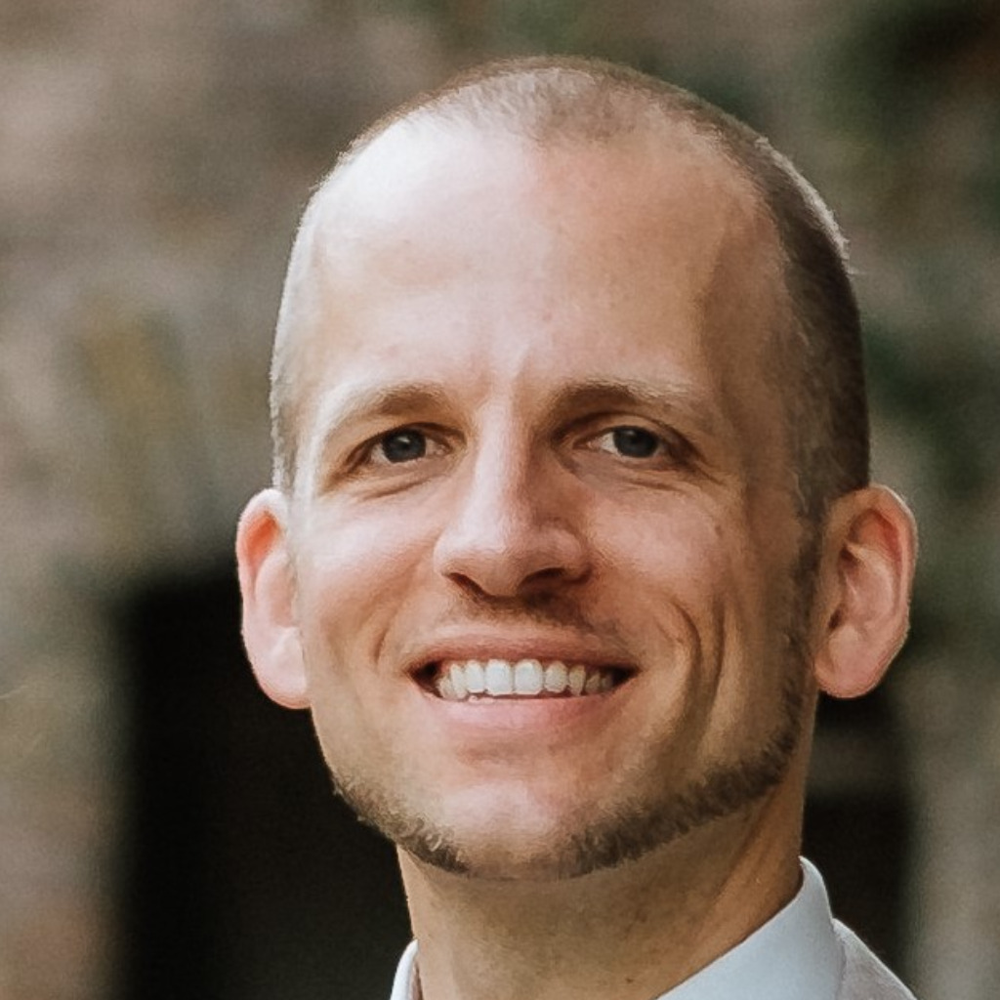

Kontakt 
  

# Schulte development

  
  

    Markus Schulte 
    Cloud consultant
  

## About me

I am working as a cloud consultant with > 10 years of experience in computer science.

Find me in the modern field of cloud computing, I have work-experience with AWS, Azure as well as
Kubernetes.

## Experience

I started working back in 2008 as en employee at [Werkenntwen](https://en.wikipedia.org/wiki/Werkenntwen).

In 2014 I started working as a freelancer and have been in ten different companies so far.

I graduated as a computer 
scientist<a href="https://drive.google.com/file/d/1EeE1uQQuspgPp41OFhpIKjGJM_Ze1NHK/view?usp=sharing" target="_blank">ref</a> 
in 2012.